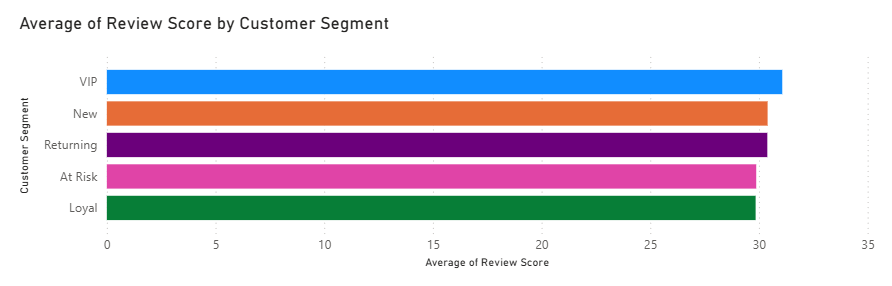
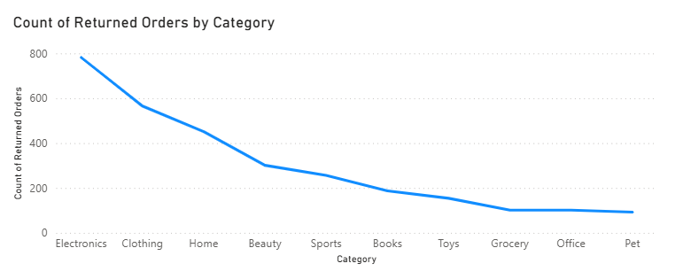
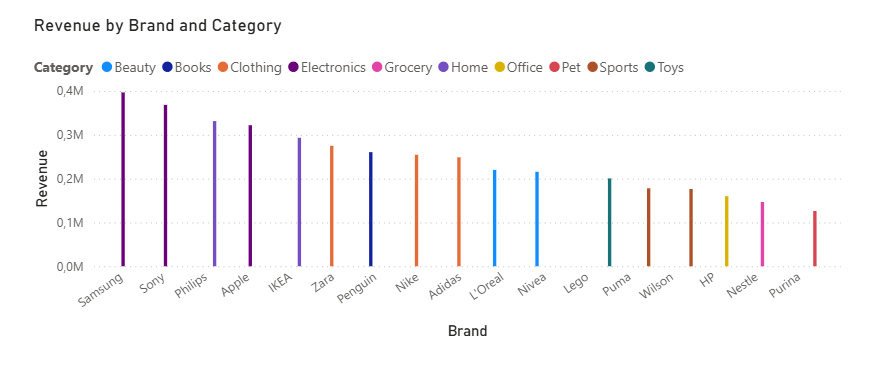

# E-commerce & Sales Analysis

This project combines Power BI and SQL to analyse customer behaviour, sales performance, and product performance using a synthetic dataset created by AI. 

---

# Project Summary

The project aim to determine which customer demographics and acquisition sources create the greatest value, which categories and brands earn the highest revenue, and how customers engage with the company with analysis. 

Power BI was used to convert important discoveries into interactive dashboards and visualisations, while SQL was utilised to explore important business questions and spot trends in the data.

The overall goal of the project is to turn raw e-commerce data into actionable insights that can support customer targeting, revenue growth, product strategy, and data-driven decision-making.

---

# Business Problems

The marketing team wants to better understand its customers so they can answer questions like: 

- Which is the best selling category within each category?
- Which is the biggest revenue brand in every category?
- Which customers are above the average lifetime value?
- What are the top countries that have the most customers?

---

# Dataset

In this project an AI-generated synthetic dataset has been used. It does not represent real customer information. 

| Table | Description |
|---|---|
| **Customers** | Customer demographics, customer segments, traffic sources, VIP status, lifetime value, order history and |
| **Orders** | Order details, product categories, brands, revenue, payment methods, discounts, review scores, order status and order dates |

These three tables connected by customer_id. 

---

# Project Workflow

```text
AI-generated Synthetic Dataset
      ↓
Explore the Data
      ↓
Data Cleaning & Preparation
      ↓
Exploratory Data Analysis
      ↓
Sales & Customer Insights
      ↓
Power BI Dashboard
      ↓
Business Insights 
```

---

# Data Cleaning

In order to simulate a realistic data cleaning procedure, data quality concerns were purposefully inserted into the raw datasets.

- Cleaning duplicate data
- Removing null and blank values
- Standardising text values
- Cleaning and validating date fields
- Converting columns to appropriate data types
- Deleting columns

---

# Exploratory Data Analysis

The dataset was analysed to gain a deeper understanding of consumer behavior prior to creating the Power BI dashboard.

The Analysis included:

- How does revenue vary across different traffic sources?
- Which customer segments generate the highest revenue?
- How does the average review score vary by customer segment?
- Which categories have the highest number of returned orders?
- Which brands and categories generate the highest revenue?
- How does the average discount vary across product categories?


--- 

# Power BI Dashboard

Power BI was used to visualise the main findings from the SQL analysis.



Compared to other customer segments, VIP customers are more likely to leave reviews and scores.



The electronics category has the highest number of returns, while the pet category has the lowest number.



Electronics category has the biggest revenue with Samsung and Sonys while pet category has the lowest revenue with Purina.


